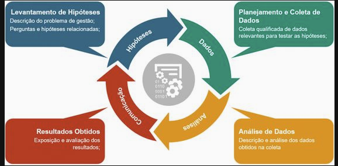
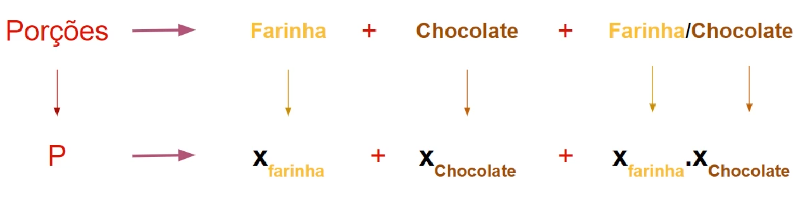
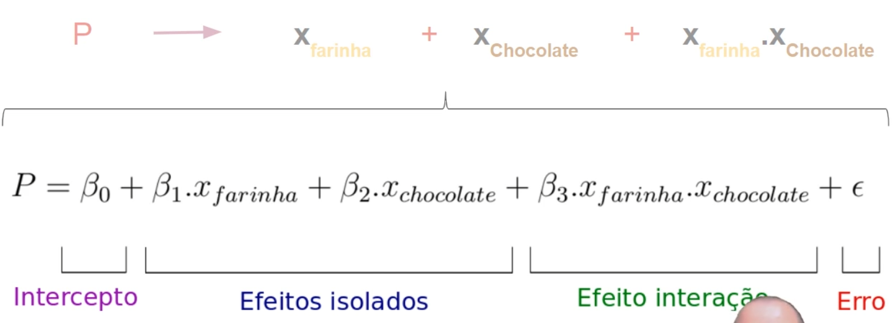

# ExperimentAnalysis

1 - Caso de estudo

Antes de planejarmos um experimento, é necessário entendermos o sistema que vamos estudar - ou seja, o nosso caso de estudo. Nesse curso acompanharemos a Bel, uma cozinheira que decidiu abrir uma empresa que vende cupcakes. Na empresa, todos os clientes cadastradores recebem, às sextas-feiras, sacolinhas com cupcakes de diversos sabores.

Como é um empreendimento em fase inicial, a Bel ainda tem muitas dúvidas sobre como passar de uma produção em escala pequena, que distribui apenas para familiares, para uma escala maior e capaz de atender um número bem maior de pessoas. Nesse cenário, a Bel precisa entender melhor a sua receita de modo a tirar mais proveito dela, evitando gastar dinheiro com ingredientes desnecessários. Com esse entendimento, será possível não produzir cupcakes de melhor qualidade, como também um número maior de cupcakes a cada fornada, aumentando seu lucro.

Dentre todos os ingredientes, aqueles que mais geram confusão na Bel são as quantidades de farinha e chocolate. Ela deseja descobrir como esses ingredientes afetam os cupcakes produzidos e, principalmente, elencar qual é o mais importante. Por exemplo, em um cenário no qual falta chocolate, será possível adicionar um pouco mais de farinha e ainda assim produzir a mesma quantidade de cupcakes? Se a farinha estiver cara, será possível compensar com uma maior quantidade de chocolate, mantendo a mesma produção de cupcakes?

Para pensar sobre essas questões, a Bel conversou com alguns amigos que já trabalham com cozinha. O Lucas, que tem uma loja de bolos e já está acostumado a produzir em grandes quantidades, acredita que a farinha é o ingrediente mais importante. Além disso, Lucas afirmou que adiciona 450g de farinha e 200g de chocolate em suas receitas, seguindo essas medidas à risca. Entretanto, ele nunca trabalhou com cupcakes - ou seja, a sua resposta é apenas representativa para bolos.

Já a amiga Ana, por sua vez, é apaixonada por cupcakes e está acostumada a prepará-los há muito tempo, ainda que não trabalhe em larga escala, se limitando a uma produção mais caseira com receita menos "restritas" (com ingredientes a gosto). Para ela, a farinha e o chocolate têm igual importância. No seu método, ela adiciona os ingredientes aos poucos e a olho, o que não ajuda muito o processo da Bel.

Após essas conversas, Bel ainda tem muitas dúvidas em relação ao papel da farinha e do chocolate no resultado final da receita, e ainda precisa de um conhecimento que seja representativo da realidade de trabalho dela - ou seja, ela está trabalhando com cupcakes, e não com bolos; e precisa saber fazê-los em larga escala, e não de modo caseiro.

A ideia é ser capaz de traduzir o seu conhecimento em números, tornando possível entender a sua receita e identificar a relação entre a proporção dos ingredientes (chocolate e farinha) e a quantidade de cupcakes produzidos. Dessa forma, ela conseguirá extrapolar, por exemplo, a quantidade de ingredientes necessária para assar um número maior de cupcakes.

Para atingir esses objetivos e estudar a sua receita, a Bel decidiu realizar um experimento. Neste experimento, ela controlará o sistema, variando a quantidade de farinha e de chocolate, e contabilizará o número de cupcakes produzidos a cada fornada. Com isso, ela garantirá que o sistema controlado é representativo da sua realidade de trabalho - isto é, receitas de cupcakes nas quantidades que ela precisa produzir em sua empresa. Além disso, ela coletará os dados necessários para entender as relações entre as variáveis e até mesmo prever os resultados.

Antes de começar a desenvolver o experimento (ou a "botar a mão na massa"), a Bel precisa planejar esses experimentos, do contrário perderá dinheiro e tempo. No próximo vídeo começaremos a entender como ela pode fazer isso!

2 - Fontes de informações

Planejar e executar um experimento usando a receita da Bel como sistema de estudo.

3 - Planejar é preciso

Vimos anteriormente que Bel decidiu realizar um experimento para entender melhor a sua receita de cupcakes (o sistema a ser analisado), e agora precisamos refletir sobre como tal experimento será conduzido.

A ideia é variarmos a quantidade de farinha e chocolate, quantificando, ao final de cada fornada, o número de cupcakes por exemplo. Por exemplo, vamos supor a utilização de 500 gramas de farinha e 100 gramas de chocolate. Ao final da primeira fornada, ela anota que foi produzida uma porção de cupcakes. Repetindo o experimento com 1000 gramas de farinha e 300 de chocolate, ela obteve 2 porções. A receita foi repetida várias vezes, enquanto Bel considerou necessário (que podemos chamar de "N vezes").

Após terminada essa etapa de coleta de dados, a ideia é utilizar métodos estatísticos para obter conclusões a partir deles. Antes de prosseguirmos para essa análise, é importante entendermos e planejarmos o experimento.

Existem motivos para fazer esse planejamento.

Ingredientes da Receita de Cupcakes (rende 12 porções):

430g de farinha

130g de chocolate

4 ovos

150g de manteiga

200g de açúcar

5g de fermento

Por exemplo, imagine que Bel deseja colocar em prática quatro ensaios. No primeiro, ela utiliza 500 gramas de farinha e 100 gramas de chocolate, o que lhe rende 19 cupcakes. No segundo ensaio, ela utiliza 500 gramas de farinha e 500 de chocolate, mas percebe que não tem a quantidade de ovos exigida na receita, adicionando apenas 2. Mesmo assim, a receita rendeu 22 porções.

Para o terceiro ensaio, além de 1000 gramas de farinha e 300 de chocolate, ela já possuía a quantidade correta de ovos, mas precisou abandonar a cozinha para comparecer a um compromisso no banco e não conseguiu contar a quantidade de cupcakes produzidos, pois já tinham sido devorados pelos sobrinhos. Para tentar resolver esse problema, ela decide somar a massa total da receita, algo em torno de 1700 gramas, para eventualmente comparar com os outros ensaios.

No quarto e último ensaio, Bel percebe que não tinha mais chocolate disponível, sendo obrigada a utilizar 750 gramas de farinha e 250 gramas de cenoura. Ao final desse processo, obteve 26 porções.

Note que a Bel realizou esses experimentos sem planejá-los muito bem, refletindo sobre eles à medida em que iniciava um determinado ensaio. Mas será que eles têm validade e é possível tirar conclusões sobre esses resultados?

Analisando criticamente o primeiro ensaio, os dados parecem completamente adequados seguindo a receita de cupcakes. Entretanto, no segundo, há uma variação na quantidade de ovos recomendada na receita base. Quando isso acontece, não é possível distinguirmos o efeito da variação da quantidade de farinha e de chocolate ou da quantidade de ovos. Desta forma, parece difícil entendermos o papel dos ingredientes que estamos analisando na receita em si, descartando o uso deste ensaio.

No terceiro ensaio temos uma situação interessante: ainda que os ingredientes tenham sido usados corretamente, temos uma variação no resultado. Ao invés de medir a quantidade de cupcakes, a Bel anotou a massa total da receita, o que não é o objetivo do experimento. Sendo assim, precisaremos descartar também este ensaio.

Por fim, no quarto ensaio a Bel comete um erro bastante grave. Ao substituir o chocolate da receita, ela acabou alterando completamente o sistema que estava analisando: ao invés de uma receita de cupcake de chocolate, ela obteve dados de uma receita de cupcake de cenoura. Portanto, esse ensaio será descartado.

Dos quatro ensaios feitos pela Bel, apenas um trouxe resultados que poderíamos analisar. Ou seja, sem o planejamento dos ensaios, ela acabou desperdiçando tempo e dinheiro. O planejamento é importante justamente para evitar problemas como esses.

Existem dois passos essenciais no planejamento de um experimento. O primeiro deles é ter um objetivo claro: que questão desejamos responder ao realizar um experimento? A Bel, por exemplo, quer entender como a variação da quantidade de farinha e chocolate afeta a produção de cupcakes. Isso significa que ela não quer saber a influência da quantidade de ovos, ou o impacto da variação dos ingredientes na massa final da receita.

Ter esse objetivo defininido ao executar o experimento evita erros, principalmente divergência em relação às finalidades de nossas análises. Ao final do experimento, teremos a certeza de que os dados coletados terão a possibilidade de responder às perguntas que guiaram os ensaios.

O segundo passo de qualquer planejamento é entender quais serão as variáveis manipuladas e a resposta. No caso da Bel, as variáveis manipuladas são a farinha e o chocolate. Os outros elementos, como quantidade de ovos, manteiga e temperatura do forno, devem permanecer obrigatoriamente constantes, de modo que os resultados obtidos não sejam influenciados por sua variação.

A resposta é aquilo que desejamos analisar por meio das estatísticas, que nesse caso é o número de cupcakes produzidos. Ter esses conceitos bem definidos também nos ajuda a não perder tempo e dinheiro medindo coisas desnecessárias.

Ao fazermos um planejamento dos experimentos, evitamos uma série de erros que podem surgir da má execução dos ensaios. Sir Ronald Fisher, um grande estatístico inglês, inclusive utilizava a seguinte frase para demonstrar a importância do planejamento:

Chamar um estatístico depois que o experimento foi feito pode ser o mesmo que pedir para ele fazer um exame post-mortem. Talvez ele consiga dizer do que foi que o experimento morreu.

Devemos nos planejar, freando um pouco a ansiedade de obter dados e respostas rapidamente. Planejar o experimento também significa que os dados utilizados na fase de análise e estatística terão qualidade adequada para responder às nossas perguntas. No próximo vídeo aprenderemos a planejar a coleta de dados.

4 - Coleta de dados

Vamos dar continuidade à tarefa de ajudar a Bel a planejar seu experimento. Agora precisamos definir as faixas de variações nas quantidades de farinha e chocolate, algo que deve ser feito de forma bastante cuidadosa, pois será a partir dessas faixas que coletaremos nossos dados experimentais.

Para definirmos essas faixas, imaginaremos que as quantidades de farinha e chocolate, em quilogramas, podem ser representadas por duas retas. Nelas teremos um ponto de origem, onde as quantidades são iguais a zero. À direita deste ponto estarão os pontos positivos, e à esquerda vamos supor que existam valores negativos. Em ambos os sentidos das retas, os valores se estendem infinitamente.

duas retas paralelas na horizontal. a primeira parte da esquerda, figura de uma xícara de farinha, e aponta para a direita, recebendo o rótulo farinha (kg). a segunda parte da figura de uma barra de chocolate e também aponta para a direita, com o rótulo "chocolate (kg)". ambas possuem, no centro, uma marcação com o valor "0". mais acima, temos a palavra "negativos", abrangendo os valores à esquerda da marcação; e "positivos", abrangendo valores à direita da marcação. ambas as palavras acompanham, um pouco abaixo, o símbolo de infinito.

Isso significa que a Bel tem infinitas possibilidades de coletas de dados, o que não é ideal para o experimento dela, certo? Sendo assim, precisaremos usar o bom senso e nosso conhecimento sobre a receita de modo a limitarmos essa faixa.

Nesse processo, a primeira questão que precisamos nos fazer é: há quantidades negativas? Quantas vezes já fomos ao mercado comprar "menos 500 gramas" de farinha ou de chocolate? Realmente, nenhuma. Portanto, parece que não existem valores negativos em nosso experimento.

Claro, é necessário tomar bastante cuidado nesse tipo de questionamento, afinal ele é bastante específico desse cenário - em outras condições e experimentos, podem existir números negativos. Por exemplo, poderíamos trabalhar em um experimento que avalia a influência da temperatura na qualidade de um produto, e sabemos que a temperatura pode assumir valores negativos. Ou seja, essa decisão vai depender do sistema que estamos analisando durante o experimento.

edição da figura anterior. a palavra "negativos" e o símbolo de infinito que a acompanhava são cobertos por um xis, e a parte das retas paralelas que representava os números abaixo da marcação "0" foi removida, restando somente as partes referentes aos valores positivos. 

Ficamos agora com praticamente metade das possibilidades, já que só manteremos os valores positivos. Contudo, isso mantém a necessidade de infinitos experimentos, já que ainda existem infinitos valores positivos. A ideia agora é restringirmos ainda mais essa faixa.

duas retas paralelas na horizontal. a primeira parte da esquerda, figura de uma xícara de farinha, e aponta para a direita, recebendo o rótulo farinha (kg). a segunda parte da figura de uma barra de chocolate e também aponta para a direita, com o rótulo "chocolate (kg)". ambas possuem, no ponto inicial, uma marcação com o valor "0". mais acima, temos a palavra "positivos", abrangendo valores à direita da marcação, e acompanhada, um pouco abaixo, do símbolo de infinito.

Para fazermos essa restrição, vamos definir limites inferiores e superiores, e é a partir deles que coletaremos os dados experimentais. Com o conhecimento que temos atualmente, podemos fazer algumas suposições gerais sobre quais serão esses valores, a começar pelo limite inferior. Provavelmente esse limite inferior não será 0, pois, segundo a nossa receita, é impossível fazer um cupcake de chocolate sem farinha ou chocolate.

Já em relação ao limite ao superior, temos que respeitar a capacidade da cozinha da Bel - afinal, não utilizaremos uma tonelada de farinha ou meia tonelada de chocolate. Para nos ajudar a restringir esses intervalos, a Bel nos informou que gostaria de assar fornadas de até 50 cupcakes.

Para descobrirmos as quantidades aproximadas necessárias para produzirmos esse resultado, realizaremos uma pesquisa em revistas de culinária e livros de receitas. A esse tipo de pesquisa dá-se o nome de "revisão bibliográfica", e ela é extremamente importante no desenvolvimento e realização de qualquer experimento. Com essa revisão, seremos capazes de entender o que outras pessoas fizeram, e inclusive evitaremos cometer os mesmos erros que elas possam ter cometido.

Após essa revisão bibliográfica, chegamos à conclusão de que, para o cenário da Bel, os melhores limites inferiores e superiores são os da tabela abaixo:

Inferior (kg)	Superior (kg)
Farinha	0.5	1.5
Chocolate	0.1	0.5
Tendo definido os limites, colocaremos os pontos experimentais nas retas.

duas retas paralelas na horizontal. a primeira parte da esquerda, figura de uma xícara de farinha, e aponta para a direita, recebendo o rótulo farinha (kg). ela possui marcações no ponto "0", no ponto "0.5" e no ponto "1.5". a segunda parte da figura de uma barra de chocolate e também aponta para a direita, com o rótulo "chocolate (kg)". ela possui marcações no ponto "0", no ponto "0.1" e no ponto "0.5"

Em seguida, manteremos a reta da farinha na horizontal e transporemos a reta que representa as quantidades de chocolate para a vertical. Não é necessário se preocupar com a escala. Essa representação nos é bastante familiar, já que determina um plano cartesiano.

plano cartesiano em que o eixo X representa a quantidade de farinha em quilogramas, com marcações marcações no ponto "0", no ponto "0.5" e no ponto "1.5". o eixo Y representa a quantidade de chocolate em quilogramas, com marcações no ponto "0", no ponto "0.1" e no ponto "0.5".

Delimitaremos então a região da qual a Bel coletará os seus pontos experimentais para realizar as análises estatísticas.

edição do plano cartesiano anterior. o encontro entre os pontos dos eixos X e Y foram utilizados para delimitar uma área retangular.

Vamos simular essa coleta. Primeiramente, a Bel coleta um ponto, por exemplo 0.8 quilogramas de farinha e 0,3 quilogramas de chocolate. Ao fim, ela quantifica o número de porções resultante, nesse caso 1. em seguida, ela retira um novo ponto em outras condições, com 1.2 quilogramas de farinha, 0.4 quilogramas de chocolate, resultando em 2 porções.

O problema desse processo é que existem infinitos pontos dentro dessa área, chamada de "área de experimentação". Será necessária uma nova abordagem. Vamos interpretar esses infinitos ensaios como uma população, que representa todos os ensaios possíveis de serem realizados. De dentro dessa população, retiraremos amostras finitas para inferirmos sobre as características da população.

Esse tipo de lógica é muito parecida com a da inferência estatística, que é quando utilizamos amostras finitas e reduzidas para inferirmos informações de populações muito grandes de dados.

Agindo desta forma, deixaremos de interpretar a área de experimentação como sendo composta de infinitos pontos, e passaremos a entendê-la como um conjunto de finitos pontos a partir dos quais a coleta de dados pode ser feita.

edição do plano anterior. dentro da área retangular que fora delimitada, temos agora 117 pontos distribuídos em 9 fileiras de 13 pontos que cobrem grande parte da área desta figura

Apesar de termos chegado a possibilidades finitas, facilitando o trabalho da Bel, ainda precisamos atender a alguns requisitos para que a definição de quais pontos serão coletados nessa amostra seja feita da melhor forma possível. O primeiro ponto é que devemos atender aos objetivos do experimento, ou seja, avaliar o efeito do chocolate e da farinha no número final de cupcakes produzidos.

O segundo ponto é que os dados coletados devem incluir toda a área de experimentação - ou seja, eles devem ser representativos da região na qual estamos realizando o estudo. Por fim, não podemos esquecer que nesse cenário a coleta de dados é custosa, já que significa um investimento em ingredientes. Portanto, desejamos que o número de dados coletados seja o menor possível.

No próximo vídeo, descobriremos qual é a melhor abordagem para atendermos a essa série de questões.

5 - Planejamento fatoriais

Anteriormente aprendermos a fazer com que o processo de coleta de dados seja finito. Nosso objetivo agora é analisar algumas propostas de escolha de quais prontos serão coletados para o experimento, de modo que, ao final, consigamos escolher aquelas que melhor satisfaçam as necessidades do projeto.

Nossa primeira proposta será, a partir da região que estabelecemos anteriormente, escolher uma linha e uma coluna, realizando o experimento nessas condições.

Vamos imaginar que escolhemos a linha central da nossa área de experimentação, ou seja, a quinta linha, usando apenas os pontos que a compõem para realizarmos o experimento. Analisando esses pontos, é possível perceber que estamos variando a quantidade de farinha, o que implica em recolher dados que representam o impacto deste ingrediente na quantidade de cupcakes produzidos.

Entretanto, nos deparamos com um problema: nós não variamos o chocolate, que permanece fixo em todos os pontos. Assim, atendemos apenas parcialmente aos objetivos do experimento, já que não avaliam o efeito do chocolate na quantidade de cupcakes produzidos.

Você pode se perguntar se não é possível tirar essas informações na fase de análise estatística, e a resposta é não. Afinal, se nossos dados experimentais não incluem determinado fenômeno, nenhum método estatístico ou análise matemática, por mais rebuscados que sejam, serão capazes de extrair essas informações.

Sabendo que precisamos variar tanto a farinha quanto o chocolate, chegamos a uma segunda opção: variar um elemento de cada vez. Por exemplo, na opção anterior tínhamos fixado o chocolate e variado a farinha em toda a sua extensão. Em seguida, poderíamos fixar a farinha numa posição e variar somente a quantidade de chocolate em toda a sua extensão, por exemplo escolhendo a coluna central da região estabelecida (a sétima coluna).

A princípio parece que estamos atendendo ao objetivo do experimento, já que avaliaremos o efeito das duas variáveis manipuláveis dentre os limites inferiores e superiores. Entretanto, o fato de variarmos um elemento de cada vez é na verdade um problema, pois não captaremos a interação entre eles.

Os pontos referentes à farinha, por exemplo, equivalem a uma quantidade fixa de chocolate. Porém, é possível que a variação da quantidade de chocolate tenha um efeito diferente sobre os experimentos. Sendo assim, por mais que essa opção pareça mais simples e lógica para as análises estatísticas, ela não nos possibilita verificar o efeito de interação entre as variáveis manipuláveis.

Apesar de contra intuitiva, a melhor forma de realizarmos o experimento é variando em conjunto ambas as variáveis manipuláveis. Para isso, escolheremos os pontos de forma aleatória. Começaremos definindo uma número de dados experimentais, e depois, a partir de um procedimento aleatório, escolheremos os dados a serem coletados.

Digamos que um procedimento aleatório escolheu aleatoriamente 13 pontos, que representaremos abaixo.

A princípio, é verificável que tais pontos incluem a variação de ambos os ingredientes e estão captando efeitos de interação entre eles, já que temos diferentes quantidades de farinha e chocolate. Contudo, os pontos experimentais escolhidos aleatoriamente, nessa conformação, estão todos reunidos na parte superior da área experimental, sem nenhum ponto na parte inferior. Dessa forma, não temos nenhuma informação sobre como se comporta nossa receita para tal parte da área experimental, ainda que tenhamos melhores resultados para outros critérios.

Em outras palavras, essa configuração dos pontos não é representativa de toda a área experimental, e precisamos que os pontos representem toda a região de estudo.

É possível afirmar que a distribuição que privilegia a parte superior seja uma casualidade, e que outro conjunto de números aleatórios possa escolher uma configuração mais interessante. Pensando nisso, digamos que nosso procedimento aleatório foi executado novamente, escolhendo 13 novos pontos para realizarmos o experimento.

Esses pontos parecem estar distribuídos de maneira mais homogênea na área experimental, além de atingirem os outros objetivos. Contudo, esses pontos ainda não incluem os limites inferiores ou superiores da quantidade de chocolate ou de farinha. Nesse caso, poderíamos aumentar o número de dados experimentais, garantindo que percorremos a área experimental em toda a sua totalidade.

Entretanto, não querermos gerar dados experimentais em excesso, afinal cada ponto experimental é uma receita de cupcake que a Bel precisará preparar, o que implica em um custo. Isso sem contar que estamos lidando com um cenário bastante simples, e, caso tivéssemos mais variáveis manipuláveis, seria ainda mais difícil enxergar se um procedimento aleatório está deixando de representar alguma área experimental. Isso significa que confiar muito em um procedimento aleatório pode não ser a melhor saída.

Tendo apresentado essas opções, vamos introduzir uma nova abordagem, bastante interessante quando a coleta de dados é custosa: o planejamento fatorial. Essa abordagem consiste em analisar os pontos nos vértices da área experimental. Agindo assim, o conjunto de pontos representará todas as possíveis combinações entre o limite inferior e superior das variáveis manipuláveis.

Analisando a conformação desses pontos, é possível perceber que eles capturam toda a variação de quantidade de farinha e chocolate - ou seja, são representativos de toda a área experimental -, e ao mesmo tempo captam efeitos de interação entre a quantidade desses ingredientes.

Outra questão interessante do planejamento fatorial é que conseguiremos atingir esses objetivos realizando poucos - nesse caso, apenas quatro. Para sabermos quantos experimentos serão realizados no planejamento fatorial, basta elevarmos o número 2, que representa os níveis (inferior e superior), por um número v que representa a quantidade de variáveis manipuláveis. Ou seja, como temos dois níveis e duas variáveis manipuláveis, nosso cálculo será 2^2 (dois elevado a segunda potência), cujo resultado são 4 ensaios.

Pegaremos esses dados e os incluiremos uma tabela na qual cada linha representa um dos ensaios do experimento da Bel.

É tradicional na realização de planejamentos fatoriais que os pontos experimentais sejam normalizados entre -1 e +1. Para isso, deslocaremos a nossa área experimental no sentido da origem do plano cartesiano. Dessa forma, o limite inferior receberá o valor -1, e o superior +1.

Agindo dessa forma, evitaremos problemas que podem surgir com variáveis manipuláveis cujas faixas de variação possuam magnitudes diferentes, ou mesmo que apresentem escalas diferentes, além de podermos incluir variáveis qualitativas no planejamento - por exemplo, as marcas de fermento utilizadas.

Agora que organizamos nossos dados experimentais, realizaremos os experimentos da Bel usando o planejamento fatorial, pois ele atende os objetivos discutidos anteriormente e possibilita que eles sejam atingidos realizando um pequeno número de ensaios. Nos próximos vídeos passaremos para a realização desses experimentos, a coleta de dados e sua análise estatística.

Coleta de dados

A princípio, poderíamos ter usado qualquer método para a escolha dos pontos experimentais.

Para o caso da Bel, deve estar claro que a linha central que guiou a escolha do planejamento fatorial foi o fato de a coleta de dados ser custosa. Portanto, o planejamento fatorial surge com uma abordagem interessante para se obter informações sobre um sistema em estudo, usando para isso uma pequena quantidade de ensaios.

Em outros contextos, a coleta de dados pode ser simples, barata e rápida. Por exemplo, poderíamos estar realizando um experimento para saber o comportamento de um usuário de um site ou app. Os dados nesse experimento seriam coletados automaticamente à medida que o usuário interagisse com a plataforma. Desse modo, podemos obter um grande número de dados que seriam coletados de forma rápida e pouco custosa. Usar um planejamento fatorial para esse caso não seria necessário, uma vez que o ato de coletar os dados não impoẽm uma barreira à fluidez do experimento; muito menos significa um acréscimo substancial dos gastos por dado adicional coletado.

Como conclusão, podemos afirmar que não existe uma regra para guiar a escolha dos pontos experimentais. Cada caso terá suas particularidades, que influenciarão a definição da melhor abordagem para a coleta dos dados. Contudo, independentemente do método, os pontos experimentais devem ser escolhidos de forma a atender os objetivos do experimento e serem representativos da região de estudo.

Para mais informações, o link a seguir aprofunda o tópico coleta de dados:
https://blog.mettzer.com/coleta-de-dados/

Coleta de dados
E abaixo, os pilares para a coleta de dados:

Pontos experimentais normalizados

Como dito, tradicionalmente o planejamento fatorial utiliza as variáveis normalizadas entre -1 e +1. Essa normalização evita termos que lidar com variáveis que possuem magnitudes muito diferentes. Além disso, o uso de valores normalizados permite a inserção de variáveis não numéricas no experimento. Por exemplo, a Bel poderia avaliar o efeito de duas marcas de fermento na quantidade de cupcakes produzidos. Vamos chamar essas duas marcas de A e B. Se não tivéssemos lidando com variáveis normalizadas, não seria direta a inclusão do efeito da marca do fermento na resposta analisada no experimento. Contudo, trabalhando com variáveis normalizadas, essa inserção torna-se natural. Para isso, bastaria dizer que, por exemplo, a marca A será o nível -1 e a marca B o +1. Pronto! Seremos capazes de analisar essa variável não numérica em conjunto com as demais, uma vez que todas elas estão definidas entre os limites -1 e +1.

Que tal agora você explorar os conhecimentos adquiridos ao longo desta aula. Como sugestão, pense em outros problemas que poderiam ser resolvidos através de um experimento (Quem sabe um outra receita). Formule o objetivo, defina as variáveis manipuláveis e a resposta do experimento, esboce a área de experimentação e como ficaria o planejamento fatorial deste experimento.

-----------------

Inserindo o experimento em um dataframe

[00:00] Agora que nós concluímos a fase de planejamento, nós vamos iniciar a análise dos dados que a Bel coletou no seu experimento. Para isso, nós vamos usar um notebook do Jupyter. Esse notebook, ele foi pensado para que nós fossemos preenchendo ele juntos, irá facilitar bastante o entendimento dos conceitos que serão apresentados no restante do curso.

[00:24] Se você ainda não fez o download desse notebook, pausa agora o vídeo, vai na página do curso e faz o download da seguinte pasta: “Aula_Planejamentos _experimentos”. Dentro dessa pasta, você encontra o notebook com... no notebook do Jupyter, onde a gente irá realizar o trabalho.

[00:44] Vamos voltar aqui para o Jupyter, vou apertar “F11” para expandir a tela. O nosso objetivo nesse primeiro vídeo é que nós inserimos os ensaios experimentais da Bel, assim como os resultados dentro de um DataFrame do Pandas e nós possamos usar esse DataFrame para facilitar a análise dos dados e a manipulação dos valores ao longo do restante do curso.

[01:13] A primeira coisa, vamos importar algumas bibliotecas, vamos importar inicialmente o Pandas, então vamos importar o Pandas, “import pandas as pd”, sendo esse “pd” um apelido que a gente está dando para o Pandas. Vamos importar também o Numpy, que o Numpy, a gente vai trabalhar com algumas matrizes ao longo desse curso.

[01:35] Então, também precisamos importar, para importar o Numpy é “import numpy as np”. Pronto, importamos o Numpy. Temos aqui o planejamento fatorial da Bel, temos nessa tabela aqui cada um dos quatro ensaios que ela realizou. Não podemos esquecer que nível inferior das quantidades é igual a “-1” e nível superior igual a “+1”.

[02:03] Nessa última coluna aqui, nós temos o resultado de cada um dos experimentos, de cada um dos ensaios. Ou seja, a quantidade de cupcakes produzidos em cada uma dessas quatro condições. Alguém podem me perguntar: “Mas a gente não vai ver a Bel fazendo o experimento, botando a mão na massa?”.

[02:22] Não precisa, basta dizer que a Bel seguiu todo aquele planejamento que a gente discutiu anterior, então a gente confia nesses resultados e vamos assumir eles, seguindo esse planejamento. Eu quero construir agora uma matriz com os ensaios e essa matriz vai ser inserida dentro de um DataFrame do Pandas.

[02:44] Então, vamos chamar essa matriz de ensaios, para construir ela, eu vou usar o método array do Numpy, então np.array, abro parênteses, depois eu vou abrir aqui o colchetes e vou agora inserir cada uma das linhas do meu experimento. O primeiro é “-1, -1”, segunda linha “+1, -1”, terceira linha, vamos com força, sem desanimar, “-1, +1”, não precisa por esse “+1”, mas se precisar, não faz diferença.

[03:36] E a nossa última linha aqui, nós vamos colocar “+1, +1”. Pronto. Apesar de rápido fazermos isso, é meio maçante colocar essa quantidade maçante de dados aqui e assim, temos poucos dados e já foi bem trabalhosa, imagina se tivéssemos muitos ensaios, o quão demorado seria.

[04:00] E quanto maior o número de ensaios, a gente poderia ter cometido um erro, colocado um mais onde não era, colocado um menos onde não era e isso poderia gerar problemas. Felizmente, existe uma biblioteca em Python, que auxilia a construção de planejamentos fatoriais.

[04:19] O nome dessa biblioteca é pyDOE, para importar o pyDOE, vamos importar o pyDOE, então é import pyDOE2, não pode esquecer esse “2”, eu já explico o porquê, import pyDOE2 as doe, sendo “doe” esse apelido que a gente está dando aqui para o pyDOE, então vamos importar.

[04:39] Por que que o “2” é importante? Existe um biblioteca chamada pyDOE sem o “2”, mas essa biblioteca não funciona muito bem no Python3. Então, assim, para evitar problemas, use, instale na sua máquina e use o pyDOE número “2” e assim, vai funcionar corretamente sem problemas nenhum.

[04:59] Para nós construirmos nossos ensaios fatoriais, os nossos ensaios aqui usando o pyDOE, vamos novamente chamar esses ensaios de ensaios, igual fizemos anteriormente, para isso vamos usar o método do pyDOE chamado “ff2n”, ou seja, ensaios fatoriais com dois níveis, nível inferior e nível superior.

[05:24] Dentro do parênteses, vamos colocar o número de variáveis manipuláveis, no nosso caso são duas, farinha e chocolate. Vamos rodar, vamos escrever aqui: ensaios, para ver como é que ficou. Ele aqui gerou, o método aqui gerou automaticamente um array, uma matriz com o planejamento.

[05:48] Vamos que ele é exatamente esse que nós descrevemos aqui, demoramos bastante para escrever. Então, assim, usem isso que irá facilitar e irá evitar que nós cometamos erro ao construir planejamentos fatoriais aqui no Jupyter ou quando estivermos usando o Python para fazer isso.

[06:06] Então, vamos agora pegar esses ensaios e inserir dentro de um DataFrame do Pandas, para isso, eu vou chamar esse DataFrame de experimento, vou chamar o “pd” de Pandas DataFrame, abro parênteses. Vou passar o nome da matriz que vai ser os dados desse DataFrame, que no nosso caso é ensaios e eu vou dar o nome das colunas de cada coluna do DataFrame.

[06:42] A primeira coluna vai ser farinha e a segunda coluna chocolate. Vamos rodar, vamos ver como é que ficou o DataFrame. Então aqui temos, temos a coluna, as colunas com farinha e chocolate, os ensaios, os valores de cada quantidade normalizadas. Temos quatro ensaios, não esquecendo que no Pandas, ele começa do zero e vai até o três.

[07:14] Agora, precisamos inserir os resultados, ou seja, o número de porções obtidas em cada ensaio. Então, vemos aqui que o número dessas porções, os resultados é 19, 37, 24 e 49. Vamos colocar aqui, para isso vamos: experimento, vamos inserir um coluna chamada “porcoes”, sem cedilha e vamos passar uma lista com os resultados, que é 19, 37, 24 e 49.

[07:52] Opa, temo que colocar o finalzinho da lista e vamos ver como é que ficou. Rodando. Temos agora aqui todos os nossos ensaios, que nós fizemos com as suas respectivas respostas no DataFrame do Pandas. Nós vamos usar esse DataFrame para fazer as análises e assim será muito mis fácil manipular esses dados e tirar conclusões. Até mais.

Modelo estatistico

[00:00] Nas análises gráficas que nós realizamos anteriormente, nós chegamos a duas importantes hipóteses, a primeira é que existe algum efeito de interação entre a quantidade de farinha e a quantidade de chocolate e a segunda hipótese, é que o efeito da farinha, ele é maior que o efeito do chocolate na quantidade de cupcakes produzidos.

[00:26] Agora, a questão é, como que nós comprovamos essa hipótese e principalmente, como que nós damos embasamento à essa comprovação usando a estatística? Uma possibilidade é nós descrevermos o nosso experimento matematicamente, para isso, vamos entende as relações existentes na elaboração do nosso experimento.

[00:49] Então, primeiramente, nós temos as porções, ou seja, as resposta que a gente está analisando, que é a quantidade de cupcakes produzidos. Essas porções, elas são influenciadas pela quantidade de farinha, pela quantidade de chocolate e nós vamos introduzir um terceiro elemento nessa relação, que é o efeito da interação entre a farinha e o chocolate.

[01:13] Vamos colocar essa representação aqui de uma forma mais matemática. Para isso, vamos chamar a porção de “P”, que vai ser a resposta da nossa expressão, a quantidade de farinha, ela vai ser uma variável, ou seja, vamos chamar ela de “Xfarinha”, então esse “Xfarinha” vai receber a quantidade de farinha que nós estamos usando no experimento.

[01:37] Por conseguinte, a quantidade de chocolate vai ser representada matematicamente por “Xchocolate” e o efeito de interação entre a farinha e o chocolate será representada pela multiplicação dessas duas variáveis. Para nós transformarmos essa relação aqui matemática, inicial, em uma igualdade e nós podermos usar ela para prever os resultados no nosso experimento, nós precisamos inserir alguns parâmetros.

[02:10] Então, vamos ver juntos e com calma, quais serão esses parâmetros que serão inseridos. Primeiramente, vamos colocar aqui o “P”, logo, temos “P”, ou seja, a quantidade de cupcakes produzidos, ele vai ser igual, primeiramente a um parâmetro, que a gente vai chamar de beta zero, que ele é o intercepto do nosso modelo, o que que é esse intercepto?

[02:33] Ele nada mais diz, que a média das respostas experimentais que nós objetivos ao longo do nosso estudo, ou seja, se pegarmos aqueles quatro ensaios, pegarmos naquela coluna as respostas, somarmos e tirarmos a média daqueles valores, vai ser o valor do intercepto.

[02:54] A farinha, ou seja, o efeito da farinha será contabilizado por um parâmetro chamado beta um, que ele vai dizer quão importante o efeito da farinha é na quantidade de cupcakes produzidos. Logo, o beta dois vai fazer o mesmo papel, só que para o efeito do chocolate.

[03:15] Esses dois conjuntos que acabamos de ver, eles serão os efeito isolados de cada uma das variáveis manipuláveis, o efeito da interação vai se contabilizado por um terceiro parâmetro, que será chamado de beta 3, ele vai nos dizer o quão importante é o efeito de interação para definir a quantidade de cupcakes produzidos.

[03:41] Nós estamos desenvolvendo esse modelo e para que esse modelo realmente fique completo, nós precisamos introduzir um outro parâmetro, que nós vamos chamar de erro. Esse erro, ele vai contabilizar a incapacidade do modelo de representar os dados experimentais.

[04:02] Usando essa expressão, nós chegamos no que é chamado de modelo estatístico, ou seja, uma representação matemática do nosso experimento. O que nós iremos fazer? Nós iremos ajustar cada um desses parâmetros, o beta zero, o beta um, o beta dois, beta três, ajustar esses dados aos nossos dados experimentais.

[04:29] E nós vamos usar esses valores já ajustados para entender a importância de cada um desses parâmetros. Entendendo a importância de cada um desses parâmetros, o nosso segundo passo será avaliar a significância estatística, ou seja, a importância estatística de cada um desses parâmetros.

[04:50] Agindo dessa forma, nós vamos ser capazes de dizer qual desses efeitos é o mais importante e segundo, entender realmente se existe um efeito de interação entre a farinha e o chocolate para definir a quantidade de cupcakes produzidos. Nós iremos fazer isso pelo ajuste desse parâmetro logo mais. Até mais.

